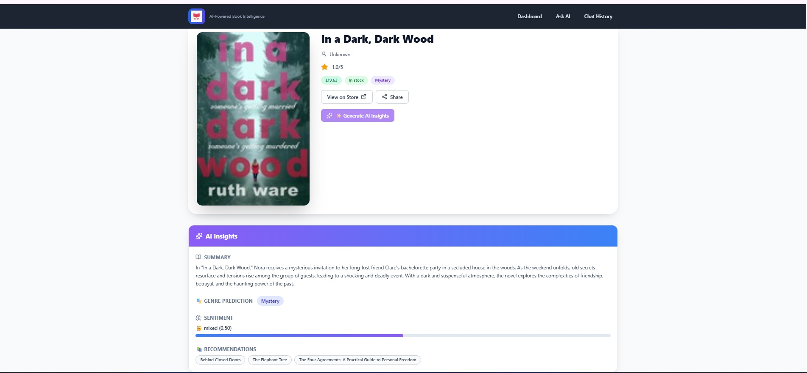
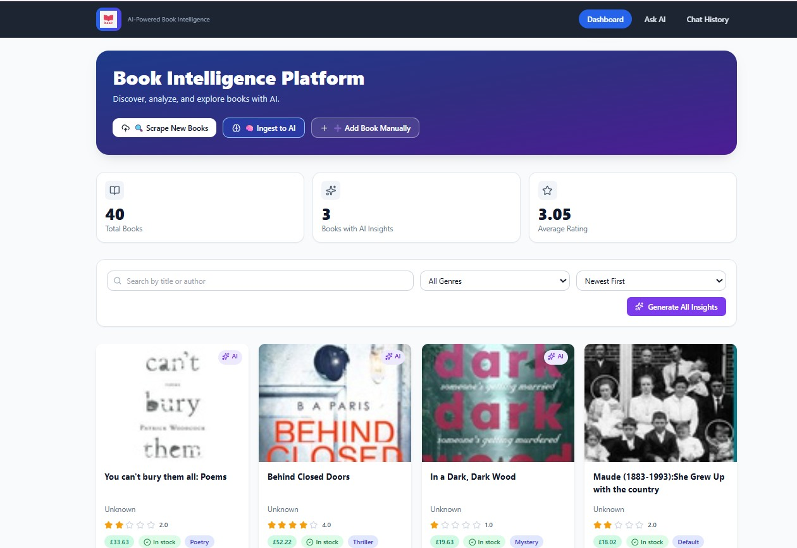
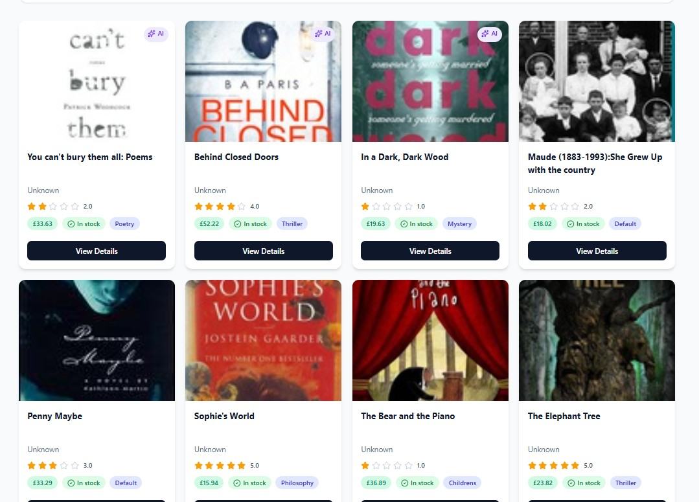
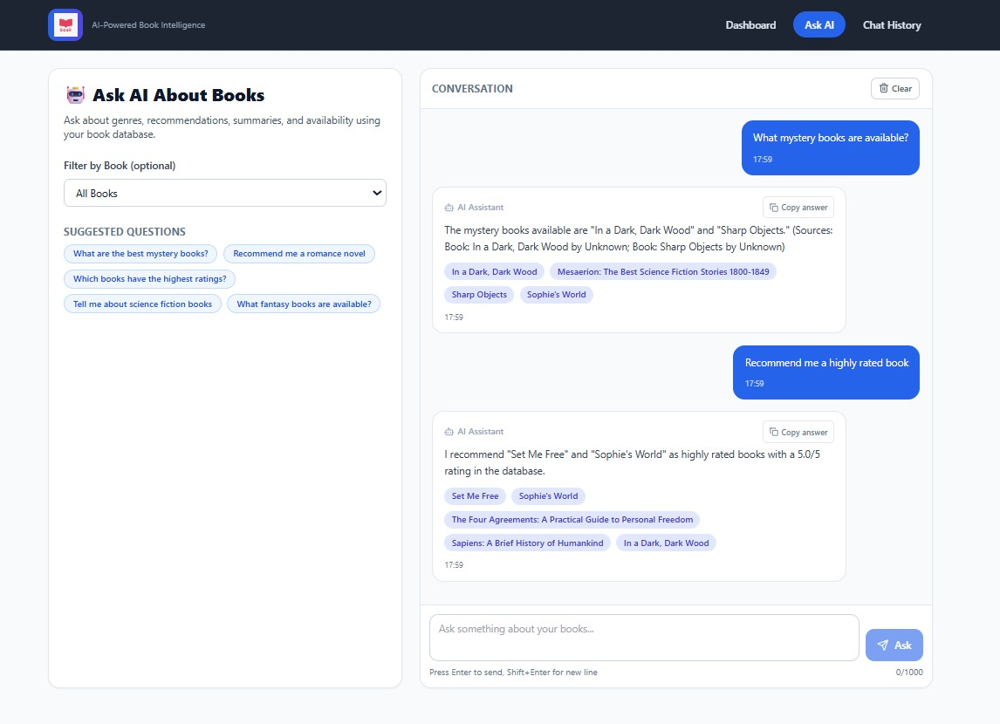
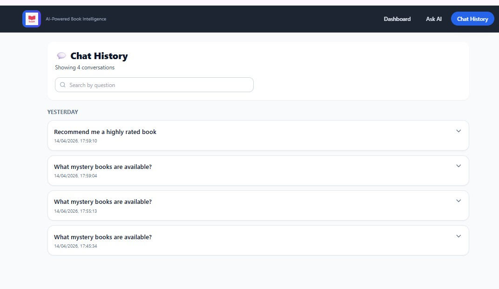
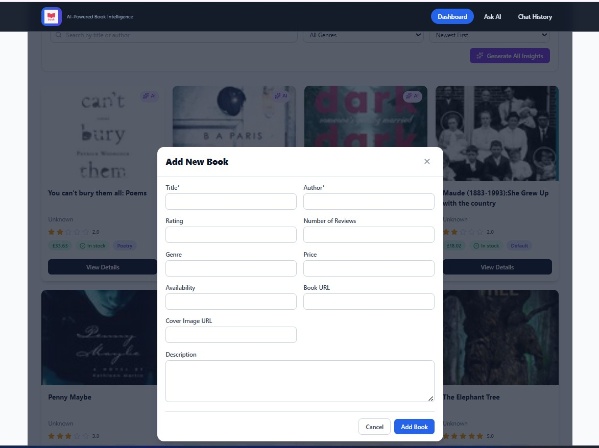

# 📚 BookIQ - AI-Powered Book Intelligence Platform

## 🚀 Overview
BookIQ is a full-stack platform that collects books, enriches them with AI-generated insights, and enables semantic Q&A using Retrieval-Augmented Generation (RAG). The backend uses Django REST Framework to orchestrate scraping, insight generation, recommendation logic, and vector ingestion into ChromaDB. The frontend provides a polished React interface for discovery, book detail exploration, AI chat, and conversation history. Together, the system demonstrates an end-to-end practical AI product workflow from data collection to user-facing intelligence.

## ✨ Features
- Automated book scraping from books.toscrape.com
- AI-generated summaries using OpenAI GPT-3.5
- Genre classification and sentiment analysis
- RAG-powered Q&A over book database
- ChromaDB vector storage for semantic search
- Book recommendations engine
- Real-time chat interface
- Caching for optimized AI calls
- Responsive React frontend
- Manual book upload modal with validation
- Cache statistics and expiration cleanup endpoint
- Bulk management command to scrape, generate insights, and ingest

## 🛠️ Tech Stack
| Component | Technology | Purpose |
|---|---|---|
| Backend | Django + Django REST Framework | API layer, orchestration, business logic |
| Database | MySQL | Persistent relational storage for books and chat history |
| Vector DB | ChromaDB | Persistent semantic vector storage |
| AI/LLM | OpenAI GPT-3.5 Turbo | Summaries, genre prediction, sentiment, RAG answer generation |
| Embeddings | OpenAI text-embedding-ada-002 | Vector embeddings for semantic retrieval |
| Frontend | React + Vite | SPA UI and client-side routing |
| Styling | Tailwind CSS | Fast, responsive utility-first UI styling |
| Scraping | Selenium + webdriver-manager | Automated data extraction from source website |
| HTTP Client | Axios | Frontend API communication |

## 📋 Prerequisites
- Python 3.9+
- Node.js 18+
- MySQL 8.0+
- OpenAI API Key
- Chrome browser (for Selenium)

## ⚙️ Setup Instructions

### Backend Setup
1. Clone the repository.
2. Change directory:
   ```bash
   cd backend
   ```
3. Create and activate a virtual environment.
4. Install dependencies:
   ```bash
   pip install -r requirements.txt
   ```
5. Create `.env` file:
   ```env
   DB_NAME=bookplatform_db
   DB_USER=root
   DB_PASSWORD=your_mysql_password_here
   DB_HOST=localhost
   DB_PORT=3306
   OPENAI_API_KEY=your_openai_api_key_here
   CHROMA_DB_PATH=./chroma_store
   ```
6. Create MySQL database:
   ```sql
   CREATE DATABASE bookplatform_db CHARACTER SET utf8mb4 COLLATE utf8mb4_unicode_ci;
   ```
7. Run migrations:
   ```bash
   python manage.py makemigrations
   python manage.py migrate
   ```
8. Start the server:
   ```bash
   python manage.py runserver
   ```

### Frontend Setup
1. Change directory:
   ```bash
   cd frontend/intern
   ```
2. Install dependencies:
   ```bash
   npm install
   ```
3. Start development server:
   ```bash
   npm run dev
   ```

### Quick Start (Populate Database)
```bash
python manage.py populate_books --pages 3
```

## 📡 API Documentation
| Method | Endpoint | Description | Request Body | Response |
|---|---|---|---|---|
| GET | `/api/books/` | List all books | None | `{ count, books[] }` |
| GET | `/api/books/<id>/` | Fetch one book detail | None | Book payload with nested insights |
| GET | `/api/books/<id>/recommendations/` | Fetch related books | None | `{ book_id, recommendations[] }` |
| POST | `/api/books/upload/` | Manually upload a book | Book fields JSON | Created book payload |
| POST | `/api/books/scrape/` | Trigger scraping | `{ "max_pages": 1..10 }` | `{ message, books_scraped }` |
| POST | `/api/books/query/` | Ask RAG question | `{ "question": "...", "book_id": optional }` | `{ question, answer, sources, chat_id }` |
| POST | `/api/books/<id>/insights/` | Generate AI insights for a book | None | AIInsight payload |
| POST | `/api/books/ingest/` | Ingest all books to ChromaDB | None | `{ message, books_ingested }` |
| GET | `/api/chat/history/` | Fetch latest chat history | None | `{ count, history[] }` |

## 💬 Sample Questions & Answers
Q: "What mystery books are available?"  
A: "The collection includes several mystery entries with strong user ratings. Based on metadata and summaries, top options include high-rated mystery titles in stock. Sources: Book A, Book B."

Q: "Recommend me a book similar to a romance novel"  
A: "If you liked romance-focused books, consider titles with overlapping sentiment and genre metadata. Suggested picks include Book C and Book D. Sources: Book C, Book D."

Q: "Which books have the highest ratings?"  
A: "The highest-rated books in your indexed dataset are those with ratings near 5.0 and strong review counts. Sources: Book E, Book F."

Q: "Tell me about science fiction books in the collection"  
A: "Science fiction entries in your collection include titles with speculative themes and future-world concepts. Sources: Book G, Book H."

Q: "What is the most affordable book available?"  
A: "From currently indexed metadata, the lowest listed price appears on Book I. Sources: Book I."

## 📁 Project Structure
```text
Ergosphere/
├── README.md
├── .gitignore
├── backend/
│   ├── .env
│   ├── manage.py
│   ├── requirements.txt
│   ├── logs/
│   │   └── django.log
│   ├── chroma_store/
│   ├── bookplatform/
│   │   ├── settings.py
│   │   ├── urls.py
│   │   ├── asgi.py
│   │   └── wsgi.py
│   └── books/
│       ├── admin.py
│       ├── ai_insights.py
│       ├── cache_utils.py
│       ├── models.py
│       ├── rag_pipeline.py
│       ├── scraper.py
│       ├── serializers.py
│       ├── urls.py
│       ├── views.py
│       ├── management/
│       │   └── commands/
│       │       └── populate_books.py
│       └── migrations/
└── frontend/
    └── intern/
        ├── package.json
        ├── tailwind.config.js
        ├── postcss.config.js
        └── src/
            ├── api/
            │   └── bookApi.js
            ├── components/
            ├── pages/
            ├── App.jsx
            ├── index.css
            └── main.jsx
```

## 🎯 Evaluation Criteria Met
- [x] Working RAG pipeline
- [x] Accurate answers with citations
- [x] Clean code with comments
- [x] Responsive UI
- [x] Caching implementation
- [x] Vector embeddings
- [x] AI-generated insights workflow
- [x] Recommendations endpoint
- [x] Management command for automation
- [x] Error handling and logging

## 🌟 Bonus Features Implemented
- TTL-based in-memory caching with stats and cleanup endpoint
- Dashboard skeleton loaders and scroll-to-top action
- Insight generation progress steps on detail page
- Share and copy interactions (URL and AI answers)
- LocalStorage-backed Q&A conversation persistence
- Mobile controls toggle in Q&A layout
- Manual book upload modal with validation
- Dedicated 404 page

## 📸 Screenshots


*Fig 1: Knowing book insights by AI*



*Fig 2: Dashboard*



*Fig 3: Books*



*Fig 4: AI Help Chat*



*Fig 5: Chat History*



*Fig 6: Adding of new book*

## 📧 Contact
For academic/project review purposes, add your name, email, and repository link here.
